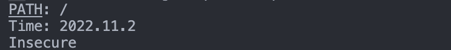
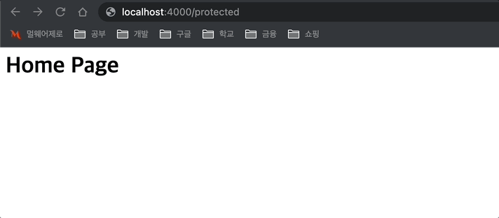

# Middlewares

---

미들웨어(Middleware)를 생성하는 실습 진행

#### 1. URL Logger

방문 중인 URL 을 기록(Log) 하는 미들웨어 생성

```javascript
const urlLogger = (req, res, next) => {
  console.log(`PATH: ${req.url}`);
  next();
};
```

#### 2. Time Logger

요청(request)했을 때의 년, 월, 일을 기록하는 미들웨어 생성

```javascript
const timeLogger = (req, res, next) => {
  const day = new Date();
  const year = day.getFullYear();
  const month = day.getMonth() + 1;
  const date = day.getDate();

  console.log(`Time: ${year}.${month}.${date}`);
  next();
};
```

#### 3. Security Logger

요청 프로토콜이 https 이면 Secure 출력, 그 외의 경우는 Insecure 출력하는 미들웨어

```Javascript
const securityLogger = (req, res, next) => {
  const protocol = req.protocol;

  if (protocol === "https") {
    console.log("Secure");
  } else {
    console.log("Insecure");
  }
  next();
};
```

#### 4. Protector Middleware

사용자가 `/protected` 로 이동하려고 할 경우 이동하지 못하도록 하는 미들웨어

```javascript
const protectorLogger = (req, res, next) => {
  const url = req.url;

  if (url === "/protected") {
    return res.status(403).send("<h1>403 forbidden</h1>");
  } else {
    next();
  }
};
```

## 결과

#### 1. 로그 출력



#### 2. `/protected` 접근 금지

protect 화면이 아닌, 미들웨어에서 보낸 메시지가 나타나며, 접근할 수 없게 만들었다.


